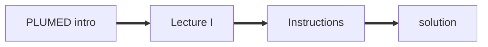

```mermaid
flowchart LR
A[PLUMED intro] ==> B[Lecture I]
B ==> C[Instructions]
C ==> D[solution]
click A "ref1" "You should complete this earlier masterclass before completing this exercise"
click B "video1" "A video that introduces the exercise"
click C "README.md" "The instructions for the exercise"
click D "notebooks/solultion.ipynb" "A python notebook containing a full set of solutions for the exercise"
```
