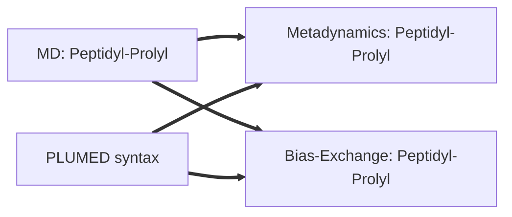

```mermaid
flowchart LR
A[MD: Peptidyl-Prolyl] ==> B[Metadynamics: Peptidyl-Prolyl]
A[MD: Peptidyl-Prolyl] ==> C[Bias-Exchange: Peptidyl-Prolyl]
D[PLUMED syntax] ==> B[Metadynamics: Peptidyl-Prolyl]
D[PLUMED syntax] ==> C[Bias-Exchange: Peptidyl-Prolyl]
click A "http://www.plumed-tutorials.org/lessons/21/001/data/NAVIGATION.html" "You should complete this earlier masterclass before completing this exercise"
click B "video1" "A video that introduces the exercise"
click C "README.md" "The instructions for the exercise"
click D "http://www.plumed-tutorials.org/lessons/21/001/data/NAVIGATION.html" "You should complete this earlier masterclass before completing this tutorial"
```
