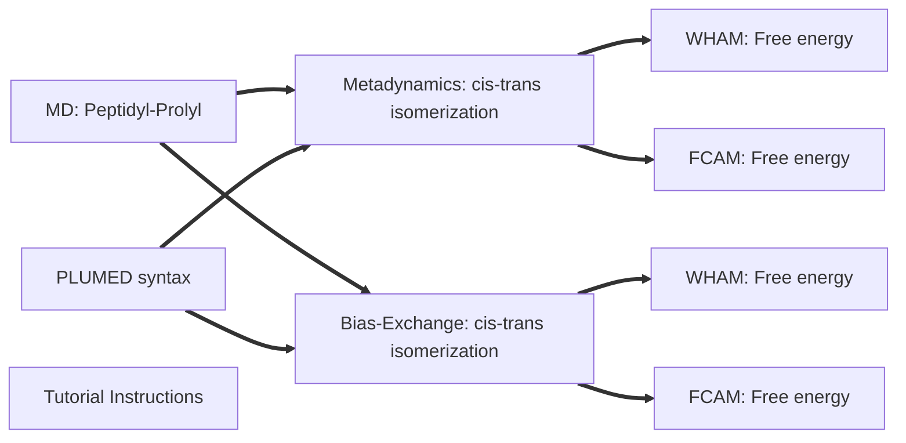

```mermaid
flowchart LR
A[MD: Peptidyl-Prolyl] ==> B[Metadynamics: cis-trans isomerization]
A[MD: Peptidyl-Prolyl] ==> C[Bias-Exchange: cis-trans isomerization]
D[PLUMED syntax] ==> B[Metadynamics: cis-trans isomerization]
D[PLUMED syntax] ==> C[Bias-Exchange: cis-trans isomerization]
B[Metadynamics: cis-trans isomerization]==>E[WHAM: Free energy]
C[Bias-Exchange: cis-trans isomerization]==>F[WHAM: Free energy]
B[Metadynamics: cis-trans isomerization]==>H[FCAM: Free energy]
C[Bias-Exchange: cis-trans isomerization]==>I[FCAM: Free energy]
G[Tutorial Instructions]
click D "tute" "A tutorial on the basic plumed syntax"
```
