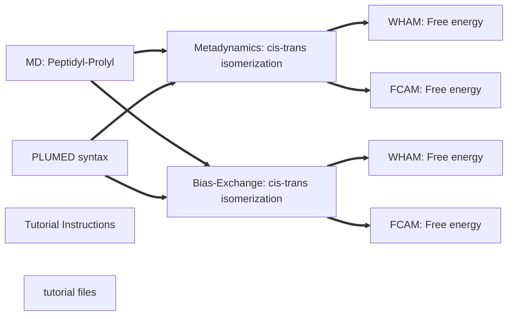

```mermaid
flowchart LR
A[MD: Peptidyl-Prolyl] ==> B[Metadynamics: cis-trans isomerization]
A[MD: Peptidyl-Prolyl] ==> C[Bias-Exchange: cis-trans isomerization]
D[PLUMED syntax] ==> B[Metadynamics: cis-trans isomerization]
D[PLUMED syntax] ==> C[Bias-Exchange: cis-trans isomerization]
B[Metadynamics: cis-trans isomerization]==>E[WHAM: Free energy]
C[Bias-Exchange: cis-trans isomerization]==>F[WHAM: Free energy]
B[Metadynamics: cis-trans isomerization]==>H[FCAM: Free energy]
C[Bias-Exchange: cis-trans isomerization]==>I[FCAM: Free energy]
G[Tutorial Instructions]
L[tutorial files]
click E "https://github.com/metagui/metagui3" "metagu3: VMD plugin for cluster and free energy analysis (Giorgino et al. Comp Phys Comm 2017)"
click F "https://github.com/metagui/metagui3" "metagu3: VMD plugin for cluster and free energy analysis (Giorgino et al. Comp Phys Comm 2017)"
click H "https://github.com/FCAM-NIH/FCAM" "FCAM: free energy calculation based on mean forces (Marinelli et al. JCTC 2021)"
click I "https://github.com/FCAM-NIH/FCAM" "FCAM: free energy calculation based on mean forces (Marinelli et al. JCTC 2021)"
click D "tute" "A tutorial on the basic plumed syntax"
click G "https://github.com/fabsugar/plumed-tutorial-be-aapak/blob/main/protocol1_md-meta-be.pdf" "Tutorial Instructions"
click L "https://github.com/fabsugar/plumed-tutorial-be-aapak/blob/main/tutorial_files.zip" "tutorial files"
```
