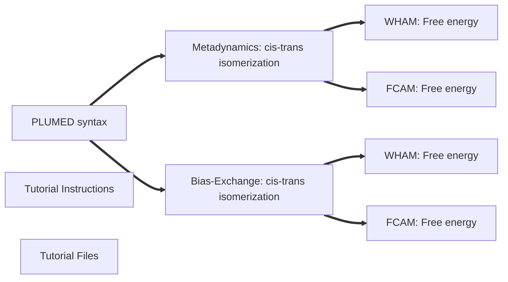

```mermaid
flowchart LR
D[PLUMED syntax] ==> B[Metadynamics: cis-trans isomerization]
D[PLUMED syntax] ==> C[Bias-Exchange: cis-trans isomerization]
B[Metadynamics: cis-trans isomerization]==>E[WHAM: Free energy]
C[Bias-Exchange: cis-trans isomerization]==>F[WHAM: Free energy]
B[Metadynamics: cis-trans isomerization]==>H[FCAM: Free energy]
C[Bias-Exchange: cis-trans isomerization]==>I[FCAM: Free energy]
G[Tutorial Instructions]
L[Tutorial Files]

click B "README.md" "PLUMED input instructions"
click C "README.md" "PLUMED input instructions"
click D "basics" "A tutorial on the basic plumed syntax"
click E "metagui" "metagu3: VMD plugin for cluster and free energy analysis (Giorgino et al. Comp Phys Comm 2017)"
click F "metagui" "metagu3: VMD plugin for cluster and free energy analysis (Giorgino et al. Comp Phys Comm 2017)"
click H "fcam" "FCAM: free energy calculation based on mean forces (Marinelli et al. JCTC 2021)"
click I "fcam" "FCAM: free energy calculation based on mean forces (Marinelli et al. JCTC 2021)"
click G "protocol1_md-meta-be.pdf" "Tutorial Instructions"
click L "files" "Tutorial Files"
```
