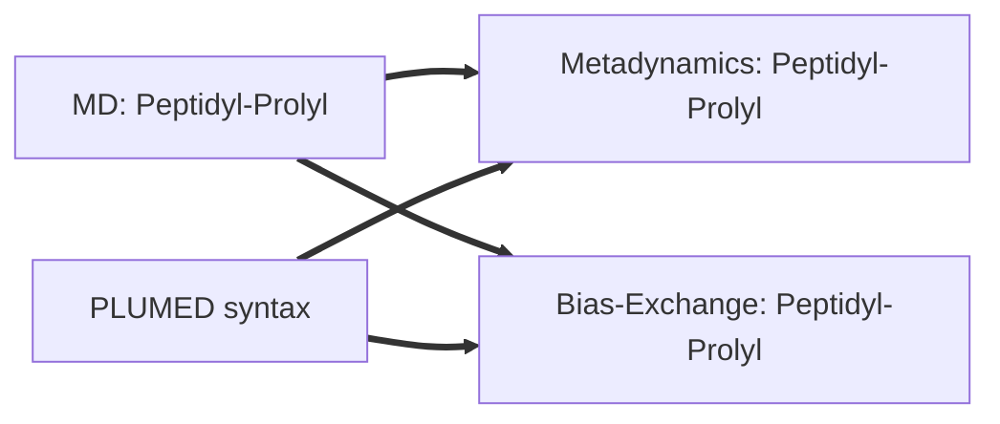

```mermaid
flowchart LR
A[MD: Peptidyl-Prolyl] ==> B[Metadynamics: Peptidyl-Prolyl]
A[MD: Peptidyl-Prolyl] ==> C[Bias-Exchange: Peptidyl-Prolyl]
D[PLUMED syntax] ==> B[Metadynamics: Peptidyl-Prolyl]
D[PLUMED syntax] ==> C[Bias-Exchange: Peptidyl-Prolyl]
click A "You should complete this earlier masterclass before completing this exercise"
click B "A video that introduces the exercise"
click C "The instructions for the exercise"
click D "tute" "A tutorial on the basic plumed syntax"
```
