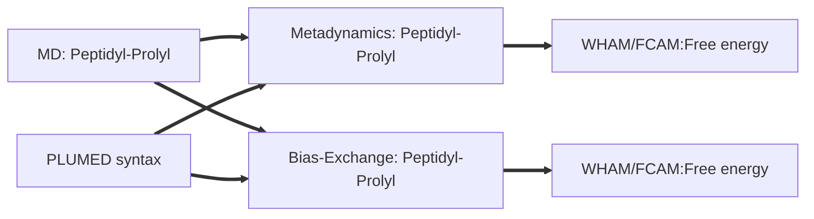

```mermaid
flowchart LR
A[MD: Peptidyl-Prolyl] ==> B[Metadynamics: Peptidyl-Prolyl]
A[MD: Peptidyl-Prolyl] ==> C[Bias-Exchange: Peptidyl-Prolyl]
D[PLUMED syntax] ==> B[Metadynamics: Peptidyl-Prolyl]
D[PLUMED syntax] ==> C[Bias-Exchange: Peptidyl-Prolyl]
B[Metadynamics: Peptidyl-Prolyl]==>E[WHAM/FCAM:Free energy]
C[Bias-Exchange: Peptidyl-Prolyl]==>F[WHAM/FCAM:Free energy]
click D "tute" "A tutorial on the basic plumed syntax"
```
