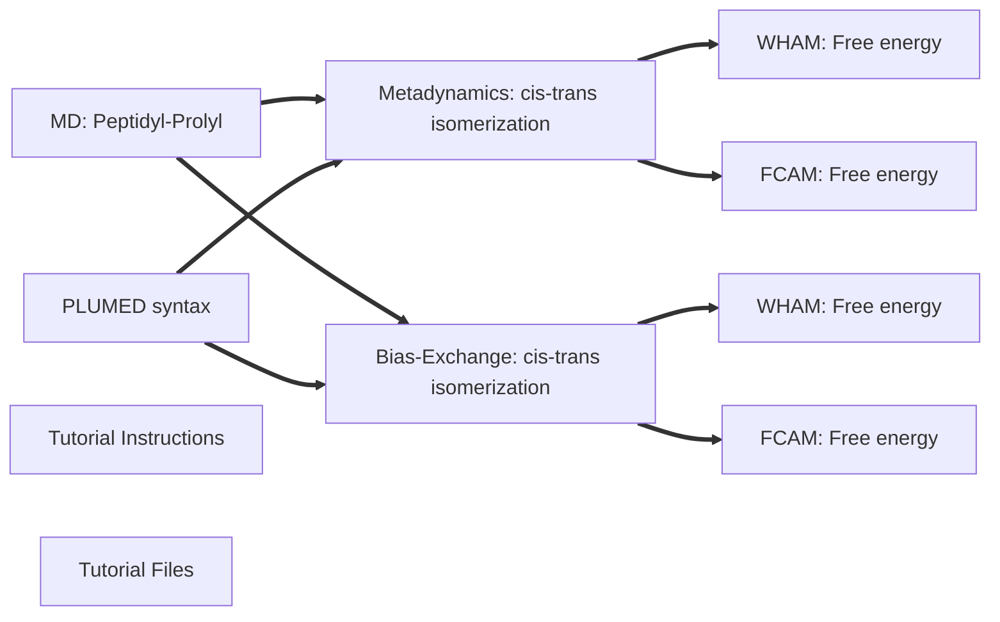

# Setting Up and Analyzing Bias-Exchange Metadynamics Simulations: the case of cis-trans isomerization of Peptidyl-Prolyl Peptides

This repository includes the required files and documentation to follow the tutorial on setting up and analyzing molecular dynamics, metadynamics and bias-exchange metadynamics simulations, specifically focusing on the cis-trans isomerization of peptidyl-prolyl peptides.
A tutorial step by step description is provided in the document: https://github.com/fabsugar/plumed-tutorial-be-aapak/blob/main/protocol1_md-meta-be.pdf.

The file `tutorial_files.zip` contain the necessary input files to perform the tutorial. It can be unpacked via `unzip tutorial_files.zip`. After unpacking, you'll find a folder with three separate files, each corresponding to a different step of the tutorial: 1) MD setup:`practical1.zip`, 2) Metadynamics and bias exchange setup:`practical2.zip`, 3) Convergence and Free energy analysis:`practical3.zip`.

